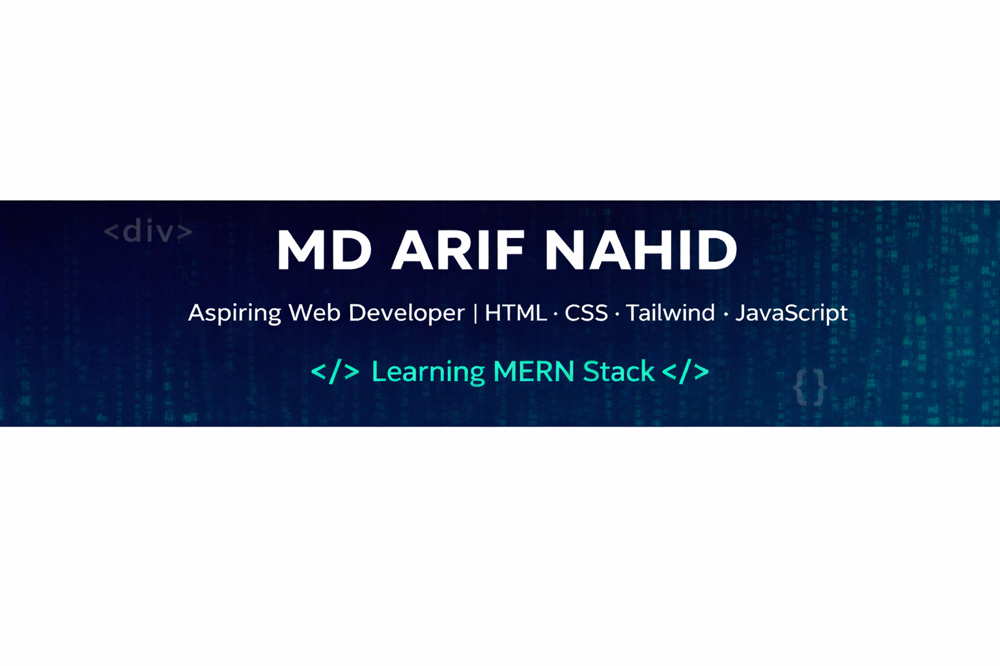

  

---

## 👨‍💻 About Me

Hello! I'm **Md Arif Nahid**, a passionate **Frontend Developer** currently living in **Saudi Arabia** 🇸🇦.  
I love building modern and responsive websites using **HTML, CSS, JavaScript, and React**.  
Right now, I'm learning and exploring the **MERN Stack** to become a full-stack web developer.

---

## 🚀 Currently Working On

- 🌱 Learning **MERN Stack Development**
- 🔥 Improving skills in **React & JavaScript**
- 💻 Building small projects to improve problem-solving
- 📌 Working on portfolio projects for GitHub

---

## 🛠️ Skills & Tools

  

---

## 🌐 Connect With Me

  

---

## 📊 GitHub Stats

  
  

---

## 🔥 GitHub Streak

  

---

## 📌 Featured Projects

- 🔹 **my-first-portfolio**
- 🔹 **serve-society**
- 🔹 **arif-assignment-4**

---

⭐ Thanks for visiting my profile!
